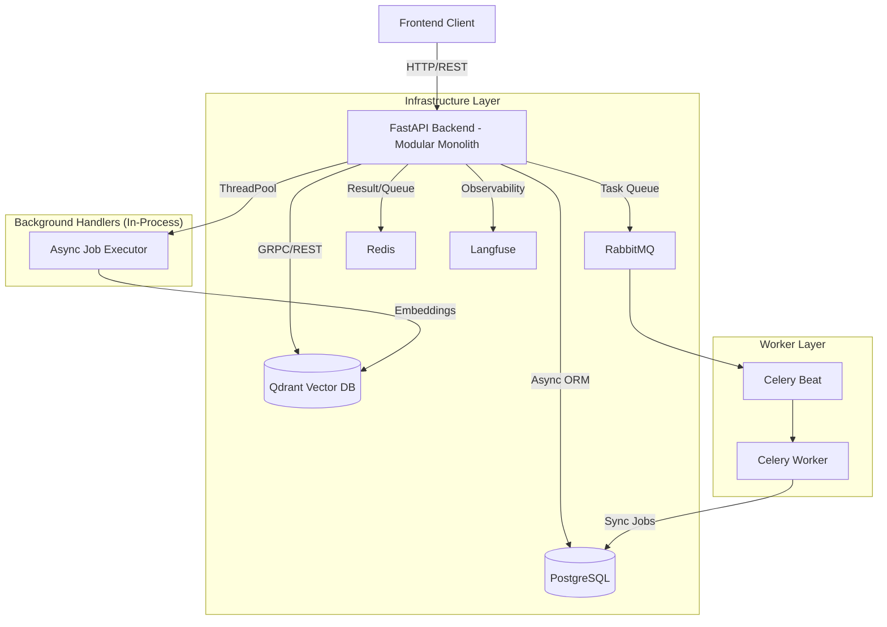
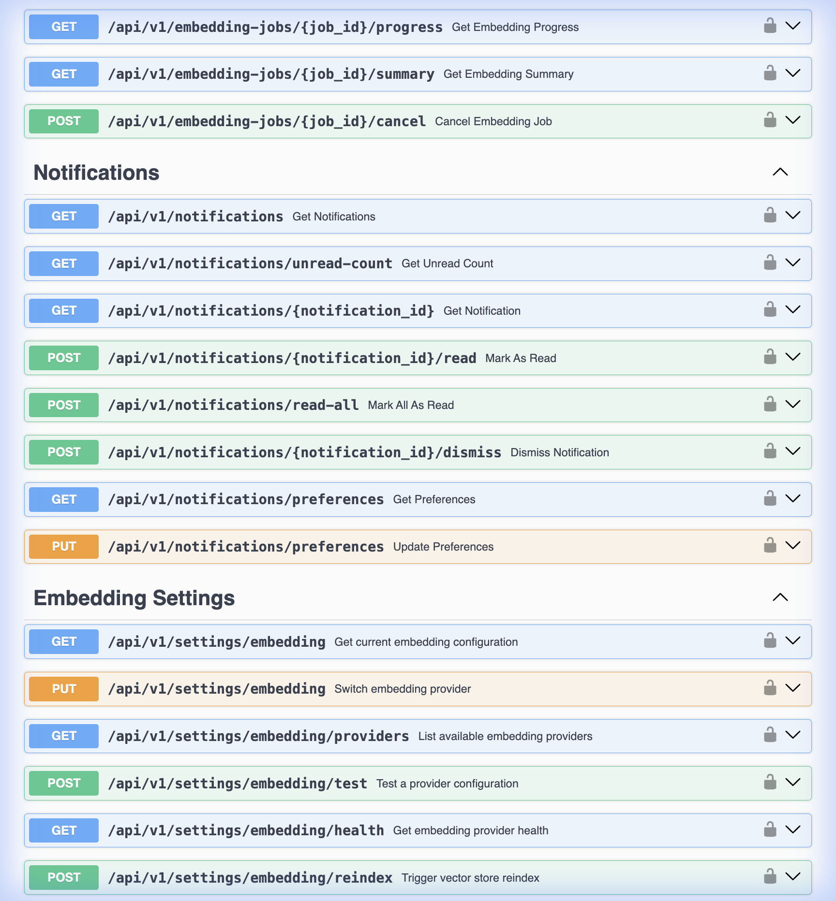
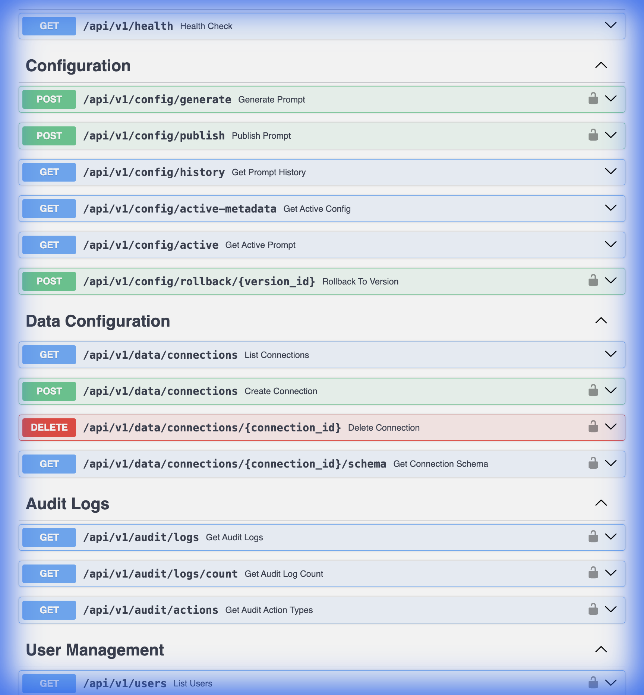
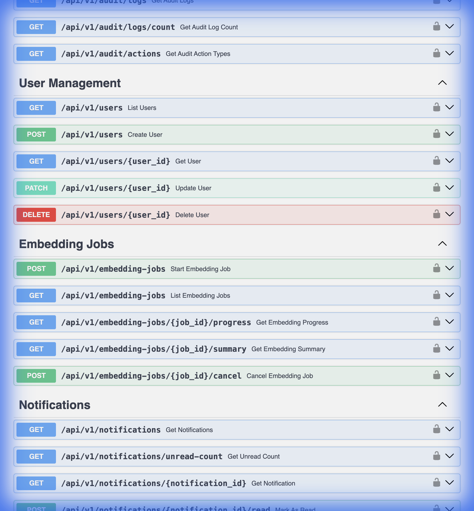
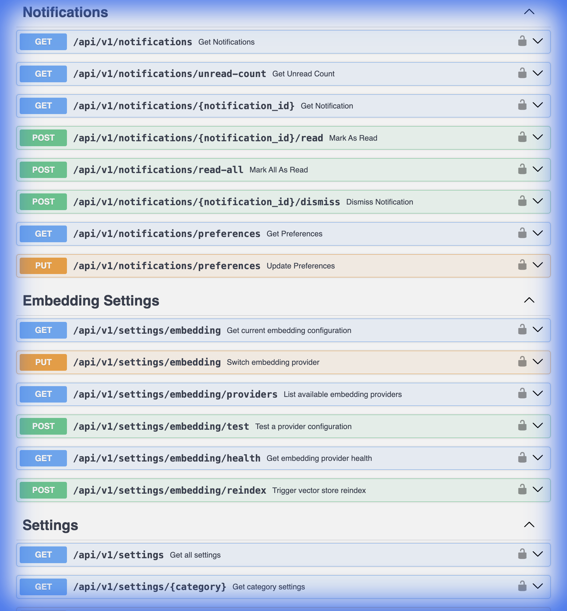

# Backend Documentation

This wiki provides comprehensive documentation for the backend of the Data Insights Copilot, covering architecture, setup, core services, database schema, and API reference.

## 1. System Overview

The backend is a **Modular Monolith** built with **FastAPI**. It orchestrates a sophisticated RAG (Retrieval-Augmented Generation) pipeline that combines structured SQL insights with unstructured vector search.

### Key Technologies
- **Framework**: FastAPI (Python 3.10+) with Uvicorn
- **Primary Database**: PostgreSQL (via `asyncpg` & SQLAlchemy 2.0)
- **Vector Database**: Qdrant (for High-Dimensional Semantic Search)
- **Task Orchestration**: 
  - **Immediate**: In-process `ThreadPoolExecutor` (async background handlers)
  - **Scheduled**: Celery Beat + RabbitMQ + Redis
- **AI/LLM Providers**: OpenAI, Anthropic, HuggingFace, Azure OpenAI, Ollama
- **Observability**: Langfuse (Tracing), Structlog (JSON Logging), OpenTelemetry

### Architecture Diagram



### Project Structure (Modular Monolith)

The backend follows a **domain-driven modular monolith** pattern within the `app/` directory.

```bash
backend/
├── app/
│   ├── core/                  # Shared infrastructure (Auth, DB Pool, Tracing)
│   ├── modules/               # Domain-specific modules
│   │   ├── users/             # Identity & Access Management
│   │   ├── agents/            # AI Agent Configuration & Prompts
│   │   ├── chat/              # RAG Orchestration & SQL Pipeline
│   │   ├── embeddings/        # Job Management & Vector Storage
│   │   ├── ingestion/         # File Upload & Schema Discovery
│   │   ├── ai_models/         # Model Registry & Download Manager
│   │   └── observability/     # Analytics & Audit Logs
│   └── app.py                 # FastAPI Entry Point
├── migrations/                # Alembic (PostgreSQL Schema)
├── scripts/                   # Migration & Setup utilities
└── tests/                     # Comprehensive Pytest suite
```

## 3. Core Modules

The application logic is organized into self-contained modules under `app/modules/`. Each module typically follows a three-layer pattern internally (`routes.py` -> `service.py` -> `repository.py`).

### 3.1 Chat Module (`app/modules/chat`)
The orchestration engine for user interactions. It handles query intent routing and executes the complex RAG or SQL pipelines.
- **SQL Execution**: Uses a reflection-based loop that validates generated SQL via a secondary LLM call to prevent hallucinations and security breaches.
- **Async-to-Sync Bridge**: A thread-safe executor that allows parallel sub-query execution during dashboard synthesis without blocking the event loop.

### 3.2 Agents Module (`app/modules/agents`)
Manages the "Personalities" and technical settings for AI Agents.
- **Config Wizard**: Step-by-step assembly of an agent (Data Source -> Chunking -> System Prompt -> Model Selection).
- **Versioning**: Each publishing action creates a new immutable config version.

### 3.3 Embeddings Module (`app/modules/embeddings`)
Manages vector indexing and job lifecycle.
- **Job States**: `QUEUED` -> `PREPARING` -> `EMBEDDING` -> `VALIDATING` -> `STORING` -> `COMPLETED`.
- **Schema-Aware Indexing**: Automatically extracts and vectorizes DDL from connected databases to improve SQL generation accuracy.

### 3.4 Ingestion Module (`app/modules/ingestion`)
Handles data intake from various sources.
- **Schema Discovery**: Proactively discovers table relationships and column statistics.
- **Raw SQL Fallback**: Implements `information_schema` scanning for restricted DB environments where standard reflection fails.

### 3.5 AI Models Module (`app/modules/ai_models`)
External provider management and local model registry.
- **Providers**: OpenAI, Anthropic, Azure, Ollama, HuggingFace.
- **Local Download**: Background manager for downloading GGUF or SentenceTransformer models with progress tracking.


## 4. Embedding System

The backend features a pluggable embedding architecture (`embedding_providers.py` & `embedding_registry.py`).

### Supported Providers
- **BGE-M3 (Default)**: Runs locally using `SentenceTransformers`. Optimized for multilingual retrieval.
- **OpenAI**: Uses `text-embedding-3-small` or `large`. Requires API key.
- **Generic HuggingFace**: Load any compatible model (e.g., `all-MiniLM-L6-v2`).

## 5. LLM System

The backend features a pluggable LLM architecture (`llm_providers.py` & `llm_registry.py`) enabling runtime switching between providers.

### Supported Providers

| Provider | Description | Requires API Key |
|----------|-------------|------------------|
| **OpenAI** | GPT-4o, GPT-4, GPT-3.5-turbo | Yes |
| **Azure OpenAI** | Azure-hosted OpenAI deployments | Yes + Endpoint |
| **Anthropic** | Claude 3.5, Claude 3 models | Yes |
| **Ollama** | Local models (Llama, Mistral, etc.) | No |
| **HuggingFace** | API or local inference | Yes (API mode) |
| **Local LLM** | GGUF models via LlamaCpp | No |

### Configuration via API

```bash
# List available providers
GET /api/v1/settings/llm/providers

# Get current configuration
GET /api/v1/settings/llm

# Switch provider (hot-swap)
PUT /api/v1/settings/llm
{
  "provider": "anthropic",
  "config": {
    "model_name": "claude-3-5-sonnet-20241022",
    "api_key": "your-api-key"
  }
}

# Validate credentials without saving
POST /api/v1/settings/llm/validate
```

### Hot-Swapping

The `LLMRegistry` allows changing LLM providers at runtime without restart. Changes are persisted to the database and take effect immediately for all new requests.


## 6. Development Tools

### Gradio Prototype (`backend/scripts/main.py`)
A standalone, interactive UI for testing the RAG pipeline without the full frontend.
- **Run**: `python -m backend.scripts.main`
- **Features**: Chat interface, plot generation, and raw retrieval inspection.
- **Note**: This is a development tool and uses its own agent logic separate from the main FastAPI app.

## 7. Database Schema

The backend uses a local SQLite database (`app.db`).

**[View Detailed Database Schema](Database.md)**

Key tables include:
- `users`: User accounts and roles.
- `system_prompts`: Versioned system prompts.
- `rag_configurations`: RAG pipeline settings.

## 8. API Reference

The API is versioned (currently `v1`).

**[View Full API Reference](API.md)**

**Base URL**: `http://localhost:8000/api/v1`

### Documentation
Interactive API documentation is available at `/docs` (Swagger UI) and `/redoc`.



### Key Endpoints

#### Authentication (`/auth`)
-   `POST /auth/login`: Obtain JWT access token.
-   `POST /auth/refresh`: Refresh expired token.
-   `GET /auth/me`: Get current user details.

#### Chat (`/chat`)
-   `POST /chat/message`: Send a message to the agent.
    -   Input: `{ "message": "Show me sales by region", "session_id": "..." }`
    -   Output: JSON containing `answer`, `chart_data`, and `sources`.

#### Data Configuration (`/data`)
-   `GET /data/connections`: List all database connections.
-   `POST /data/connection`: Add a new database source.
-   `GET /data/schema`: Explore tables and columns of a connection.



#### Embedding Jobs (`/embedding/jobs`)
-   `POST /embedding/jobs`: Start a new ingestion job.
-   `GET /embedding/jobs/{job_id}`: Check status/progress.
-   `POST /embedding/jobs/{job_id}/cancel`: Stop a job.



#### System Settings (`/settings`)
-   `GET /settings/prompts`: Get history of system prompts.
-   `POST /settings/prompts`: Publish a new system prompt version.



## 9. Development & Testing

### Running Tests
The project uses `pytest` for testing.

```bash
# Run all tests
pytest

# Run specific test file
pytest tests/test_sql_service.py
```

### Logging
Logs are written to `logs/backend.log` (if configured) and standard output.
Log level can be controlled via `LOG_LEVEL` in `.env`.

## 10. Troubleshooting

### Common Issues

1.  **"Database Locked"**:
    -   SQLite allows only one writer at a time. Ensure no other heavy processes are locking `app.db`.
    
2.  **OpenAI Rate Limits**:
    -   Check `OPENAI_API_KEY` in `.env`.
    -   If rate limited, the Agent will degrade gracefully but may fail on complex queries.

3.  **Missing Tables in Chat**:
    -   Ensure the Schema has been "Refreshed" in the Data Settings.
    -   Check if the tables are excluded in `SQLService` (e.g., demo tables).

## 11. Observability & Tracing

The backend includes comprehensive observability features for monitoring LLM usage, costs, and performance.

### Langfuse Integration

All LLM calls are automatically traced via [Langfuse](https://langfuse.com):

```python
# Automatic tracing via LLMRegistry
llm = registry.get_langchain_llm(with_tracing=True)  # Attaches Langfuse callback

# Manual decoration for custom operations
from langfuse import observe

@observe(as_type="span")
def my_custom_operation():
    ...
```

### Local Langfuse Setup

```bash
# Start local Langfuse
docker-compose -f docker-compose.langfuse.yml up -d

# Access at http://localhost:3001
```

### Environment Variables

```bash
ENABLE_LANGFUSE=true
LANGFUSE_PUBLIC_KEY=pk-lf-...
LANGFUSE_SECRET_KEY=sk-lf-...
LANGFUSE_HOST=http://localhost:3001
```

### Observability API Endpoints

| Endpoint | Method | Description |
|----------|--------|-------------|
| `/observability/config` | GET | Get current observability settings |
| `/observability/config` | PUT | Update log level, tracing settings |
| `/observability/usage` | GET | Get usage statistics (tokens, costs) |
| `/observability/test-log` | POST | Emit a test log message |

**[View Full Observability Documentation](Observability.md)**

## 12. Related Documentation

- [API Reference](API.md)
- [Database Schema](Database.md)
- [RBAC & Permissions](RBAC.md)
- [Observability & Tracing](Observability.md)
- [Deployment Guide](Deployment.md)
